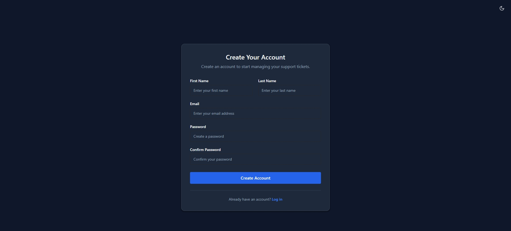
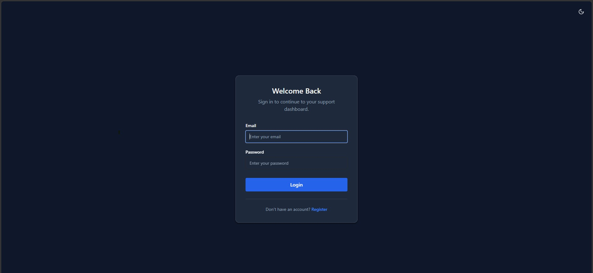
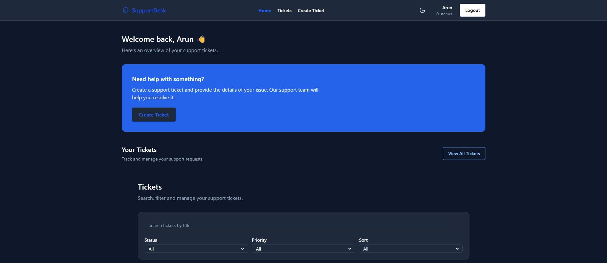
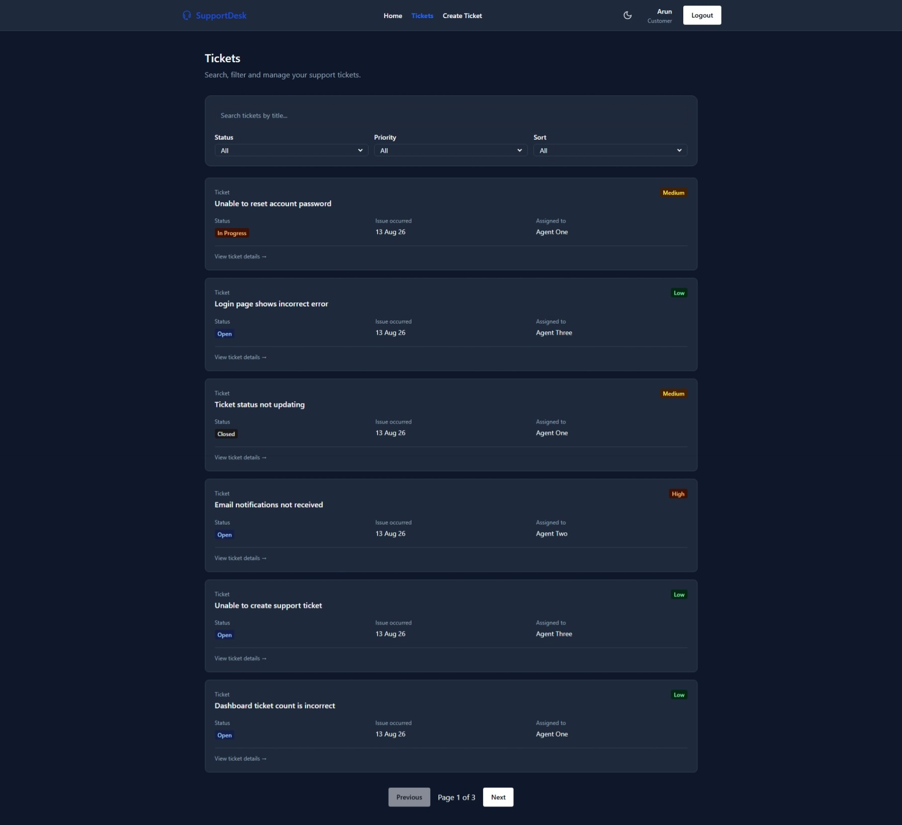
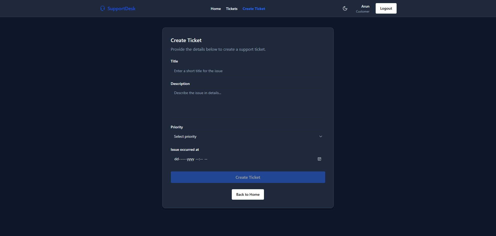
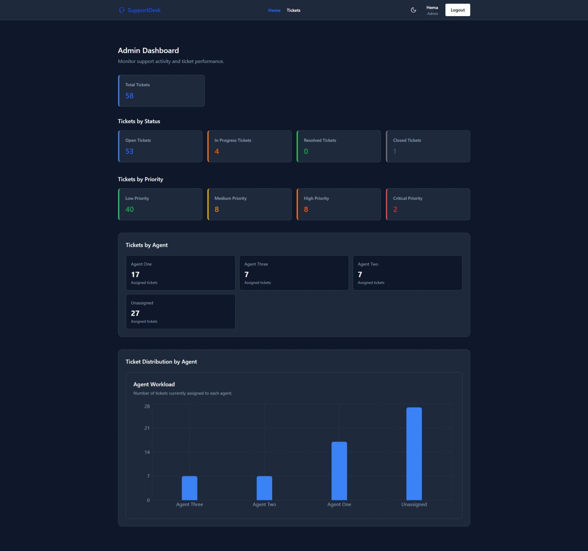
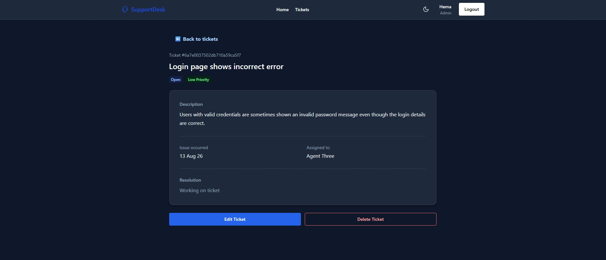
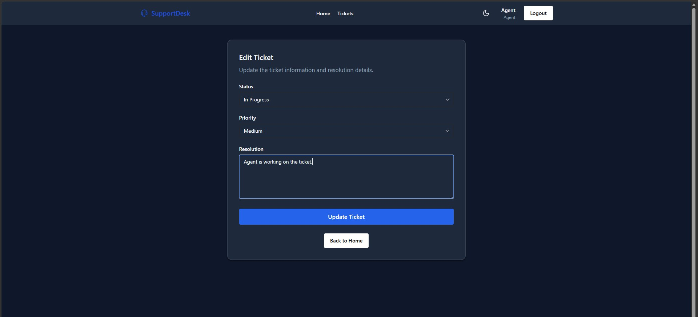

# Customer Support Ticket Management System

A full-stack **MERN-based Customer Support Ticket Management System** that enables customers to create and track support tickets while agents and administrators manage, update, and resolve those tickets through a role-based workflow.

The project was built to demonstrate practical full-stack development skills including **REST API design, JWT authentication, role-based authorization, MongoDB data modeling, aggregation, server-side filtering/pagination/sorting, React Context API, protected routes, form validation, and production deployment**.

---

## 🚀 Live Demo

* **Frontend:** https://supportdesk-ei3l.onrender.com
* **Backend API:** https://customer-support-ticket-api.onrender.com


---

## 📌 Project Overview

Customer support teams need a centralized system to manage customer issues from creation through resolution.

This application provides a structured ticket-management workflow with three user roles:

* **Customer** — creates and tracks support tickets.
* **Agent** — works on assigned/support tickets and updates their progress.
* **Admin** — has full system access and can manage users and tickets.

The application follows a client-server architecture:

```text
React Frontend
      │
      │ HTTP / REST API
      ▼
Node.js + Express Backend
      │
      │ Mongoose
      ▼
MongoDB Database
```

Authentication is handled using **JWT**, while passwords are securely hashed using **bcrypt**.

---

# ✨ Key Features

## 🔐 Authentication & Authorization

* User registration and login
* JWT-based authentication
* Secure password hashing with bcrypt
* Persistent authentication using `localStorage`
* Protected API routes
* Role-based authorization
* Three user roles:

  * Customer
  * Agent
  * Admin
* JWT contains authenticated user's ID and role
* Backend authorization prevents unauthorized operations

---

## 🎫 Ticket Management

Customers can:

* Create support tickets
* View their own tickets
* View ticket details
* Track ticket status
* Set ticket priority
* Provide issue description
* Record when the issue occurred

Agents can:

* View tickets available to them
* Update ticket status
* Update ticket priority
* Work on tickets through the support workflow

Admins can:

* View all tickets
* Update ticket information
* Manage ticket workflow
* Delete tickets
* Manage higher-level system operations

---

## 🔄 Ticket Workflow

Tickets follow a controlled lifecycle:

```text
Open
  ↓
In Progress
  ↓
Resolved
  ↓
Closed
```

Available statuses:

* `Open`
* `In Progress`
* `Resolved`
* `Closed`

Available priorities:

* `Low`
* `Medium`
* `High`
* `Critical`

The backend enforces authorization and ticket-management rules rather than relying only on frontend restrictions.

---

## 🔎 Search, Filtering & Sorting

The ticket list supports server-side query functionality including:

* Search
* Status filtering
* Priority filtering
* Sorting
* Pagination

Example:

```text
GET /tickets?page=1&limit=10&status=Open&priority=High
```

This keeps filtering and pagination responsibilities on the backend and avoids loading the entire ticket collection into the browser.

---

## 📄 Pagination

Ticket results are paginated using query parameters such as:

```text
?page=1&limit=10
```

The API returns both ticket data and pagination metadata, allowing the frontend to build a reusable pagination experience.

Example response structure:

```json
{
  "success": true,
  "data": [],
  "pagination": {
    "page": 1,
    "limit": 10,
    "total": 50,
    "totalPages": 5
  }
}
```

---

## 📊 Dashboard & Aggregation

The backend uses **MongoDB aggregation pipelines** for dashboard-related statistics.

This demonstrates working with MongoDB beyond basic CRUD operations.

Aggregation can be used to derive information such as:

* Total tickets
* Tickets by status
* Tickets by priority
* Ticket distribution
* Other operational metrics

---

# 👥 User Roles & Permissions

| Feature             | Customer | Agent | Admin |
| ------------------- | :------: | :---: | :---: |
| Register            |     ✅    |   ❌   |   ❌   |
| Login               |     ✅    |   ✅   |   ✅   |
| Create Ticket       |     ✅    |   ❌   |   ❌   |
| View Own Tickets    |     ✅    |   —   |   —   |
| Update Ticket       |     ❌    |   ✅   |   ✅   |
| Delete Ticket       |     ❌    |   ❌   |   ✅   |
| Access All Tickets  |     ❌    |   ❌   |   ✅   |
| Manage Agent Access |     ❌    |   ❌   |   ✅   |

> Agent accounts are not self-registered. Agent access is intended to be controlled by an administrator.

---

# 🛠️ Tech Stack

## Frontend

* **React**
* **Vite**
* **JavaScript**
* **Chakra UI**
* **React Router**
* **Context API**
* **Axios**
* React Hooks

## Backend

* **Node.js**
* **Express.js**
* **MongoDB**
* **Mongoose**
* **JWT**
* **bcrypt**
* **express-validator**
* **Morgan**
* **CORS**
* **dotenv**

## Deployment

* Frontend - Backend: **Render**
* Database: **MongoDB Atlas**

---

# 🏗️ Application Architecture

The application follows a layered client-server architecture.

```text
                         ┌─────────────────────┐
                         │    React Frontend   │
                         │                     │
                         │  Pages / Components │
                         │  Context API        │
                         │  React Router       │
                         │  Axios              │
                         └──────────┬──────────┘
                                    │
                              HTTP / REST
                                    │
                                    ▼
                         ┌─────────────────────┐
                         │  Express Backend    │
                         │                     │
                         │ Routes              │
                         │ Middleware          │
                         │ Controllers         │
                         │ Utilities            │
                         └──────────┬──────────┘
                                    │
                               Mongoose
                                    │
                                    ▼
                         ┌─────────────────────┐
                         │      MongoDB        │
                         │                     │
                         │ Users               │
                         │ Tickets             │
                         └─────────────────────┘
```

---

# 🔐 Authentication Flow

The application uses JWT-based authentication.

```text
                                User
                                │
                                │ Login credentials
                                ▼
                                React Login Page
                                │
                                │ POST /users/login
                                ▼
                                Express API
                                │
                                │ Validate credentials
                                ▼
                                MongoDB
                                │
                                │ User found
                                ▼
                                bcrypt password verification
                                │
                                ▼
                                JWT generated
                                │
                                ▼
                                Frontend
                                │
                                ├── Store token
                                └── Store user information
                                      │
                                      ▼
                                Axios Interceptor
                                      │
                                      │ Authorization: Bearer <token>
                                      ▼
                                Protected API Routes
```

The shared Axios instance automatically attaches the JWT to authenticated requests.

---

# 🛡️ Authorization Flow

Authentication answers:

> "Who is the user?"

Authorization answers:

> "What is this user allowed to do?"

The backend uses middleware to verify the JWT and determine the authenticated user's role.

For example:

```text
Request
   ↓
authMiddleware
   ↓
Verify JWT
   ↓
Extract user ID + role
   ↓
Role authorization
   ↓
Controller
```

This ensures that security rules are enforced at the API level rather than trusting the frontend.

---

# 🗄️ Database Design

## User

The user model contains:

```text
User
├── firstName
├── lastName
├── email
├── password
└── role
```

Supported roles:

```text
customer
agent
admin
```

Passwords are hashed before being stored.

---

## Ticket

The ticket model contains:

```text
Ticket
├── title
├── description
├── issueOccuredAt
├── status
├── priority
└── createdBy
```

`createdBy` is a MongoDB reference to the corresponding user.

### Status

```text
Open
In Progress
Resolved
Closed
```

### Priority

```text
Low
Medium
High
Critical
```

---

# 📁 Project Structure

The repository is organized into separate frontend and backend applications.

```text
customer-support-ticket-system/
│
├── customer-support-ticket-system-frontend/
│   │
│   ├── src/
│   │   ├── components/
│   │   │   ├── Navbar/
│   │   │   ├── Layout/
│   │   │   ├── TicketCard/
│   │   │   └── ...
│   │   │
│   │   ├── pages/
│   │   │   ├── Home/
│   │   │   ├── Tickets/
│   │   │   ├── TicketDetails/
│   │   │   ├── CreateTickets/
│   │   │   └── ...
│   │   │
│   │   ├── context/
│   │   │   ├── AuthContext
│   │   │   └── TicketContext
│   │   │
│   │   ├── hooks/
│   │   │   ├── useDebounce
│   │   │   └── useForm
│   │   │
│   │   ├── api/
│   │   ├── routes/
│   │   ├── App.jsx
│   │   └── main.jsx
│   │
│   ├── public/
│   ├── .env
│   ├── package.json
│   └── vite.config.js
│
├── customer-support-ticket-system-backend/
│   │
│   ├── controllers/
│   ├── middleware/
│   ├── models/
│   ├── routes/
│   ├── utils/
│   ├── config/
│   ├── server.js
│   ├── .env
│   └── package.json
│
└── README.md
```

> The exact folder structure may differ slightly depending on the latest repository organization.

---

# 🌐 REST API

The backend exposes RESTful endpoints for authentication, users, tickets, and dashboard functionality.

## Authentication

| Method | Endpoint          | Description         |
| ------ | ----------------- | ------------------- |
| `POST` | `/users/register` | Register a customer |
| `POST` | `/users/login`    | Authenticate user   |

---

## Tickets

| Method   | Endpoint       | Description           |
| -------- | -------------- | --------------------- |
| `GET`    | `/tickets`     | Get tickets           |
| `GET`    | `/tickets/:id` | Get ticket by ID      |
| `POST`   | `/tickets`     | Create a ticket       |
| `PATCH`  | `/tickets/:id` | Update ticket         |
| `PUT`    | `/tickets/:id` | Replace/update ticket |
| `DELETE` | `/tickets/:id` | Delete ticket         |


---

# 🧩 Backend Architecture

The backend separates responsibilities across different layers.

```text
            Request
              ↓
            Route
              ↓
            Validation Middleware
              ↓
            Authentication Middleware
              ↓
            Authorization
              ↓
            Controller
              ↓
            Utility / Query Builder
              ↓
            Mongoose Model
              ↓
            MongoDB
              ↓
            Response
```

### Middleware

Middleware handles cross-cutting responsibilities such as:

* Authentication
* Authorization
* Request validation
* Error handling
* Request logging

### Validation

`express-validator` is used to validate incoming request data before it reaches the controller.

Example flow:

```text
Validation Rules
      ↓
Validation Middleware
      ↓
Controller
```

This keeps controllers cleaner and provides consistent validation responses.

---

# 🔎 Ticket Query Utilities

The backend uses reusable query utilities for ticket retrieval.

These utilities handle responsibilities such as:

```text
buildFilter()
buildSort()
buildPagination()
```

This separates query-building logic from the controller and makes the ticket API easier to maintain and extend.

---

# ⚛️ Frontend Architecture

The React application uses Context API to manage shared application state.

```text
AuthProvider
     ↓
TicketProvider
     ↓
BrowserRouter
     ↓
App
     ↓
Pages / Components
```

## AuthContext

Responsible for:

* Current user
* Authentication state
* Login
* Logout
* Persisting authentication information

---

## TicketContext

Responsible for shared ticket state including:

* Tickets
* Loading state
* Error state
* Pagination
* Ticket fetching

The ticket fetching function is memoized using `useCallback` to maintain a stable function reference when consumed by components and effects.

---

# 🔄 React Data Flow

A typical ticket-list request follows this flow:

```text
        Tickets Page
            │
            │ useEffect()
            ▼
        fetchTickets()
            │
            ▼
        Ticket API
            │
            ▼
        Axios
            │
            ▼
        Express API
            │
            ▼
        MongoDB
            │
            ▼
        API Response
            │
            ▼
        TicketContext
            │
            ▼
        Tickets Page
            │
            ▼
        Ticket Cards
```

---

# 🧠 Important Technical Concepts Demonstrated

This project was intentionally built to go beyond basic CRUD.

### React

* Functional components
* Props
* State management
* `useState`
* `useEffect`
* `useContext`
* `useCallback`
* Custom hooks
* Context API
* Protected routes
* Conditional rendering

### Backend

* REST API development
* Express middleware
* Authentication middleware
* Role-based authorization
* Request validation
* Controller architecture
* Reusable utility functions
* Error handling
* MongoDB queries
* MongoDB aggregation
* Mongoose population
* Pagination
* Filtering
* Sorting

### Security

* Password hashing with bcrypt
* JWT authentication
* Protected routes
* Role-based access control
* Environment variables
* Backend ownership checks

---

# 🔒 Security Considerations

Several security practices are implemented:

### Password Hashing

Passwords are never stored in plain text.

```text
Plain Password
      ↓
bcrypt
      ↓
Hashed Password
      ↓
MongoDB
```

### JWT Authentication

Authenticated requests use:

```http
Authorization: Bearer <JWT>
```

### Backend Authorization

Frontend UI restrictions are not treated as security boundaries.

The backend validates:

* Authentication
* User role
* Resource ownership
* Allowed operations

---

# ⚙️ Environment Variables

## Backend

Create a `.env` file inside the backend directory:

```env
PORT=5000
MONGODB_URI=your_mongodb_connection_string
JWT_SECRET=your_jwt_secret
```

Add any additional environment variables required by the deployed configuration.

---

## Frontend

Create a `.env` file inside the frontend directory:

```env
VITE_API_URL=http://localhost:5000/api
```

For production:

```env
VITE_API_URL=your_production_backend_url
```

---

# 💻 Local Setup

## Prerequisites

Make sure the following are installed:

* Node.js
* npm
* MongoDB / MongoDB Atlas
* Git

---

## 1. Clone the Repository

```bash
git clone <YOUR_GITHUB_REPOSITORY_URL>
```

```bash
cd customer-support-ticket-system
```

---

## 2. Install Backend Dependencies

```bash
cd customer-support-ticket-system-backend
npm install
```

---

## 3. Configure Backend Environment Variables

Create:

```text
.env
```

and add:

```env
PORT=5000
MONGODB_URI=your_mongodb_connection_string
JWT_SECRET=your_jwt_secret
```

---

## 4. Start the Backend

```bash
npm run dev
```

The backend should start on:

```text
http://localhost:5000
```

---

## 5. Install Frontend Dependencies

Open another terminal:

```bash
cd customer-support-ticket-system-frontend
npm install
```

---

## 6. Configure Frontend Environment Variables

Create:

```text
.env
```

Add:

```env
VITE_API_URL=http://localhost:5000/api
```

---

## 7. Start the Frontend

```bash
npm run dev
```

Vite will provide the local development URL in the terminal.

---

# 📦 Production Build

To create the frontend production build:

```bash
npm run build
```

The generated production files will be placed in:

```text
dist/
```

To preview the production build locally:

```bash
npm run preview
```

---

# 🧪 Testing & Debugging Approach

During development, the application was tested across:

* Authentication flows
* Protected routes
* Role-based access
* Ticket creation
* Ticket updates
* Ticket deletion
* Search
* Filtering
* Sorting
* Pagination
* API validation
* Unauthorized requests
* Invalid ticket IDs
* Invalid request data
* Frontend/backend integration

Browser developer tools and backend logging were used to trace request and rendering behavior.

---

# 🐛 Key Debugging Lessons

One of the important debugging challenges involved repeated API requests caused by React rendering and effect dependencies.

The issue highlighted the interaction between:

* Context API
* `useEffect`
* Component mounting/unmounting
* State updates
* Function references
* `useCallback`
* Strict Mode

The solution involved moving shared ticket-fetching logic into `TicketContext` and stabilizing the `fetchTickets` function with `useCallback`.

This helped establish a cleaner separation between:

```text
Page-specific UI state
        ↓
Shared ticket state
        ↓
API communication
```

---

# 🚀 Deployment

The backend is deployed using **Render**, with the application configured to communicate with the production MongoDB database and frontend.

Production architecture:

```text
User Browser
     │
     ▼
Deployed React Application
     │
     │ HTTPS REST API
     ▼
Deployed Express API
     │
     ▼
MongoDB Atlas
```

Before deployment, environment-specific values such as API URLs, database credentials, and JWT secrets are configured through deployment environment variables.

---

# 📸 Screenshots

### Register



### Login



### Customer Dashboard



### Ticket List



### Create Ticket



### Ticket Details


### Admin Dashboard



### Admin Ticket Details



### Agent Edit Ticket



---

# 🎯 Project Goals

The primary goals of this project were to:

* Build a production-style MERN application
* Practice REST API development
* Implement JWT authentication
* Implement role-based authorization
* Work with MongoDB and Mongoose
* Implement real-world business rules
* Build reusable React components
* Manage shared state using Context API
* Implement server-side pagination, filtering, and sorting
* Use MongoDB aggregation
* Handle frontend/backend integration
* Deploy a full-stack application
* Improve debugging and architectural thinking

---

# 📚 What I Learned

Through this project, I strengthened my understanding of full-stack application development.

Key learning areas include:

* Designing REST APIs
* Structuring Express applications
* JWT authentication and authorization
* Password hashing
* MongoDB data modeling
* Mongoose references and `populate`
* MongoDB aggregation pipelines
* Server-side pagination
* Query filtering and sorting
* React Context API
* React rendering behavior
* `useEffect` dependency management
* `useCallback` and function identity
* Protected routes
* API error handling
* Form validation
* Environment configuration
* Frontend/backend deployment
* Debugging full-stack applications

---

# 🔮 Future Improvements

Potential future enhancements include:

* Ticket assignment to specific agents
* Ticket comments/replies
* Customer-agent conversation history
* Email notifications
* Attachment support
* SLA tracking
* Agent workload dashboard
* Advanced analytics
* Ticket activity/audit history
* Password reset
* Refresh-token based authentication
* Automated testing
* Rate limiting
* More comprehensive admin user management

---

# 🏆 Project Highlights

This project demonstrates practical experience with:

```text
MERN Stack
   │
   ├── React
   ├── Node.js
   ├── Express.js
   └── MongoDB
```

along with:

```text
Authentication
Authorization
REST APIs
CRUD
Validation
Aggregation
Pagination
Filtering
Sorting
Context API
Custom Hooks
Debugging
Deployment
```

The focus was not only on making the application work, but also on understanding **how the frontend, backend, database, authentication, authorization, and state-management layers interact as one system**.

---

# 👨‍💻 Author

**Nitesh Kumar**

Full Stack MERN Developer | Senior Quality Analyst transitioning into Software Development

* GitHub: https://github.com/Nitu2610
* LinkedIn: www.linkedin.com/in/nitesh-kumar-mern

---

## ⭐ If you found this project useful

Feel free to explore the repository, review the implementation, and share feedback.

---

## 📄 License

This project is created for learning, portfolio, and demonstration purposes.
